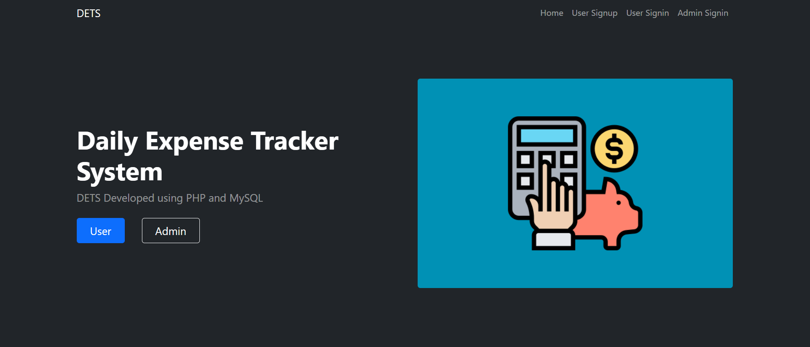
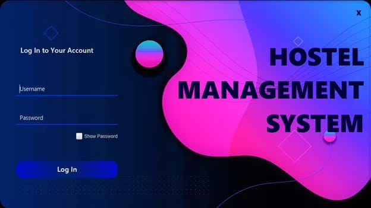

# Internship
# Sourabh's Portfolio

Welcome to my developer portfolio! This portfolio showcases my skills, projects, and passion as a web developer. I have created this portfolio to provide a glimpse of my work and experience in the field of web development.

## Table of Contents
- [Introduction](#introduction)
- [Projects](#projects)
  - [Daily Expense Tracker System](#daily-expense-tracker-system)
  - [Hostel Management System](#hostel-management-system)
- [Contact](#contact)

## Introduction
My name is Sourabh and I am a passionate web developer. This portfolio website is designed to provide information about me, my skills, and the projects I have worked on. I believe in creating user-friendly and visually appealing websites that cater to both functionality and aesthetics.

## Projects

### Daily Expense Tracker System

For this project, I developed a web-based Daily Expense Tracker System using PHP and Java. The system allows users to effectively manage their daily expenses, categorize spending, and generate insightful reports. It offers a user-friendly interface and helps users maintain control over their budgets.

### Hostel Management System

The Hostel Management System is another project I worked on. This comprehensive web-based application simplifies the management of hostels or dormitories. It allows administrators to manage student records, assign rooms, track payments, and generate occupancy reports. The system enhances the overall hostel management experience for administrators and residents.

## Contact
Feel free to reach out to me if you have any questions or would like to discuss potential collaborations. You can contact me at [your@email.com](mailto:your@email.com).

---

Thank you for visiting my portfolio!
